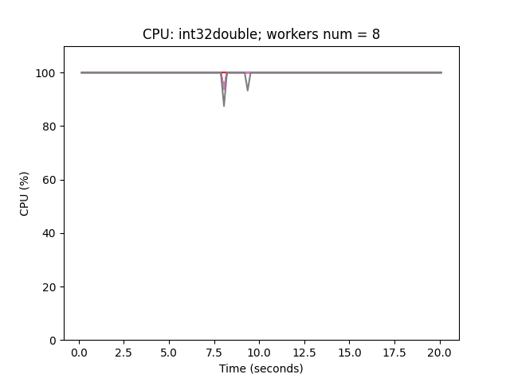
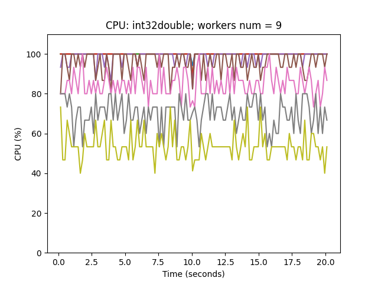
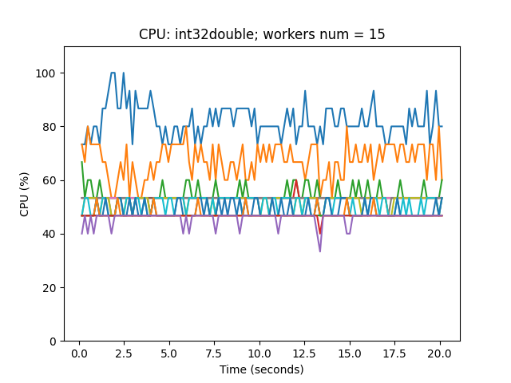

# Лабораторная работа №5 (Бенчмарк ОС)

## Цель работы
Основная цель лабораторной работы — знакомство с системными инструментами анализа производительности и поведения программ. В данной лабораторной работе Вам будет предложено произвести нагрузочное тестирование Вашей операционной системы при помощи инструмента ```stress-ng```.

## Описание задания

В качестве тестируемых подсистем использовать: ```cpu, cache, io, memory, network, pipe, scheduler.```

Для работы со счетчиками ядра использовать все утилиты, которые были рассмотренны на лекции *(раздел 1.9, кроме kdb)*

Ниже приведены списки параметров для различных подсистем (Вам будет выдано 2 значения для каждой подсистемы согласно варианту в журнале). Подбирая числовые значения для выданных параметров, и используя средства мониторинга, добиться максимальной производительности системы (*BOGOPS, FLOPS, Read/Write Speed, Network Speed*).

___Параметры для *cpu*___:

`all ackermann apery bitops callfunc cdouble cfloat clongdouble collatz correlate cpuid crc16 decimal32 decimal64 decimal128 dither div16 div32 div64 double euler explog factorial fibonacci fft fletcher16 float float32 float64 float80 float128 floatconversion gamma gcd gray hamming hanoi hyperbolic idct int128 int64 int32 int16 int8 int128float int128double int128longdouble int128decimal32 int128decimal64 int128decimal128 int64float int64double int64longdouble int32float int32double int32longdouble intconversion ipv4checksum jmp lfsr32 ln2 logmap longdouble loop matrixprod nsqrt omega parity phi pi prime psi queens rand rand48 rgb sieve stats sqrt trig union zeta`

___Параметры для *cache*___:

`cache-fence, cache-level, cache-prefetch, cache-ways, l1cache, l1cache-line-size, l1cache-sets, l1cache-ssize, l1cache-ways, prefetch-l3-size, stream-l3-size`

___Параметры для *io*___:

`iomix, ioport, ioprio, io-uring`

___Параметры для *memory*___:

`fork-vm, lockbus, madvise, mcontend, memfd, memfd-fds, memrate, memthras, misaligned-method, mmaphuge-mmaps, prefetch, shm, zlib-mem-level`

___Параметры для *network*___:

`dccp, netdev, netlink-proc, netlink-task, sockdiag`

___Параметры для *pipe*___:

`oom-pipe, pipe-ops, pipe-data-size, pipe-size, pipeherd, pipeherd-yield, sigpipe`

___Параметры для *sched*___:

`sched-prio, sched-period, sched-runtime, sched-deadline, resched, schedpolicy, yield`

___Построить графики (подходящие по заданию.)___:
* Потребления программой CPU;
* Нагрузки, генерируемой программой на подсистему ввода-вывода;
* Нагрузки, генерируемой программой на сетевую подсистему;
* Другие графики, необходимые для демонстрации работы.

___Содержание отчета___:
* Описание шагов выполненных для сбора информации (включая исходные тексты всех использованных скриптов и вспомогательных программ);
* Полученные графики, результаты выполнения скриптов и вспомогательных программ;
* Выводы по работе.

___Темы для подготовки к защите лабораторной работы___:
1. Структура процесса;
2. Виртуальная память;
3. Системные утилиты сбора статистики ядра;
4. Основы ввода-вывода (блочный и последовательный ввод-вывод);
5. Файловая система procfs;
6. Использование утилиты strace, ltrace, bpftrace;
7. Профилирование и построение flamegraph'а и stap;

## Параметры варианта

```
cpu:    [int32double, omega]; 
cache:  [cache-fence, l1cache]; 
io:     [iomix, ioprio]; 
memory: [memfd-fds, shm]; 
network:[netlink-task, netlink-proc]; 
pipe:   [pipeherd-yield, pipe-data-size]; 
sched:  [sched-deadline, schedpolicy]
```

# Бенчмарк CPU

```
cpu:    [int32double, omega]; 
```

Запустим утилиту ```stress-ng``` для методов стресс-теста ```int32double, omega``` c количеством worker'ов `(2, 4, 8, 16, 32)` с перенаправлением результатов в `sar` – утилиту для отображения статистики работы системы за текущий день с данными до запуска `-u`, и снятием данных `5` раз каждую `1` секунду.

```bash
    for method in int32double omega
    do
        for workers in 1 2 3 4 5 6 7 8 9 10 11 12 13 14 15
        do
            echo "start: $workers workers with method: $method"
            uptime
            stress-ng --cpu $workers --cpu-method $method --timeout 60 --metrics | sar -u ALL 1 5
            uptime
        done
    done
```

## Метод int32double

Применямые утилиты:
* stress-ng --metrics
* sar -u ALL
* top -b

### Bogops


Можем заметить по графику Bogo ops от Workers num, что до 8 Workers Bogo ops растет, а дальше начинается стагнация. На графиках потребления cpu от времени видно, что при 8 воркерах все ядра задействованы почти на 100% (моментарные провалы).
Для последующих Workers более существенные провалы и шумы.

### Cpu utilization


Также видна почти прямая на графике утилизации ядер VM в yandex-cloud

### Cpu(%)

```
start: 1 workers with method: int32double
 15:09:31 up 105 days,  1:17,  1 user,  load average: 0.00, 0.31, 1.72
Linux 5.15.0-84-generic (ubuntu-vm)     01/21/2024      _x86_64_        (8 CPU)
stress-ng: info:  [52139] setting to a 60 second run per stressor
stress-ng: info:  [52139] dispatching hogs: 1 cpu

03:09:31 PM     CPU      %usr     %nice      %sys   %iowait    %steal      %irq     %soft    %guest    %gnice     %idle
03:09:32 PM     all     12.77      0.00      0.00      0.25      0.00      0.00      0.00      0.00      0.00     86.98
03:09:33 PM     all     12.59      0.00      0.37      0.00      0.00      0.00      0.00      0.00      0.00     87.03
03:09:34 PM     all     12.62      0.00      0.25      0.00      0.00      0.00      0.00      0.00      0.00     87.12
03:09:35 PM     all     12.52      0.00      0.00      0.00      0.00      0.00      0.13      0.00      0.00     87.36
03:09:36 PM     all     12.62      0.00      0.00      0.00      0.00      0.00      0.00      0.00      0.00     87.38
Average:        all     12.62      0.00      0.12      0.05      0.00      0.00      0.03      0.00      0.00     87.17
stress-ng: info:  [52139] successful run completed in 60.00s (1 min, 0.00 secs)
stress-ng: info:  [52139] stressor       bogo ops real time  usr time  sys time   bogo ops/s     bogo ops/s CPU used per
stress-ng: info:  [52139]                           (secs)    (secs)    (secs)   (real time) (usr+sys time) instance (%)
stress-ng: info:  [52139] cpu              677474     60.00     59.99      0.00     11291.23       11293.12        99.98
 15:10:31 up 105 days,  1:18,  1 user,  load average: 0.63, 0.44, 1.67
 ```


 ```
start: 2 workers with method: int32double
 15:10:31 up 105 days,  1:18,  1 user,  load average: 0.63, 0.44, 1.67
Linux 5.15.0-84-generic (ubuntu-vm)     01/21/2024      _x86_64_        (8 CPU)
stress-ng: info:  [52213] setting to a 60 second run per stressor
stress-ng: info:  [52213] dispatching hogs: 2 cpu

03:10:31 PM     CPU      %usr     %nice      %sys   %iowait    %steal      %irq     %soft    %guest    %gnice     %idle
03:10:32 PM     all     25.03      0.00      0.13      0.00      0.00      0.00      0.13      0.00      0.00     74.72
03:10:33 PM     all     25.03      0.00      0.25      0.00      0.00      0.00      0.00      0.00      0.00     74.72
03:10:34 PM     all     25.19      0.00      0.13      0.00      0.00      0.00      0.00      0.00      0.00     74.69
03:10:35 PM     all     24.97      0.00      0.00      0.00      0.00      0.00      0.12      0.00      0.00     74.91
03:10:36 PM     all     25.00      0.00      0.00      0.00      0.00      0.00      0.12      0.00      0.00     74.88
Average:        all     25.04      0.00      0.10      0.00      0.00      0.00      0.07      0.00      0.00     74.78
stress-ng: info:  [52213] successful run completed in 60.00s (1 min, 0.00 secs)
stress-ng: info:  [52213] stressor       bogo ops real time  usr time  sys time   bogo ops/s     bogo ops/s CPU used per
stress-ng: info:  [52213]                           (secs)    (secs)    (secs)   (real time) (usr+sys time) instance (%)
stress-ng: info:  [52213] cpu             1304724     60.00    119.98      0.00     21745.38       10874.51        99.98
 15:11:31 up 105 days,  1:19,  1 user,  load average: 1.50, 0.73, 1.69
```


```
start: 3 workers with method: int32double
 15:11:31 up 105 days,  1:19,  1 user,  load average: 1.50, 0.73, 1.69
Linux 5.15.0-84-generic (ubuntu-vm)     01/21/2024      _x86_64_        (8 CPU)
stress-ng: info:  [52290] setting to a 60 second run per stressor
stress-ng: info:  [52290] dispatching hogs: 3 cpu
03:11:31 PM     CPU      %usr     %nice      %sys   %iowait    %steal      %irq     %soft    %guest    %gnice     %idle
03:11:32 PM     all     37.58      0.00      0.00      0.12      0.00      0.00      0.37      0.00      0.00     61.92
03:11:33 PM     all     37.70      0.00      0.12      0.00      0.00      0.00      0.00      0.00      0.00     62.17
03:11:34 PM     all     37.50      0.00      0.12      0.00      0.00      0.00      0.12      0.00      0.00     62.25
03:11:35 PM     all     37.50      0.00      0.00      0.00      0.00      0.00      0.12      0.00      0.00     62.38
03:11:36 PM     all     37.41      0.00      0.00      0.00      0.00      0.00      0.25      0.00      0.00     62.34
Average:        all     37.54      0.00      0.05      0.02      0.00      0.00      0.17      0.00      0.00     62.21
stress-ng: info:  [52290] successful run completed in 60.00s (1 min, 0.00 secs)
stress-ng: info:  [52290] stressor       bogo ops real time  usr time  sys time   bogo ops/s     bogo ops/s CPU used per
stress-ng: info:  [52290]                           (secs)    (secs)    (secs)   (real time) (usr+sys time) instance (%)
stress-ng: info:  [52290] cpu             1959073     60.00    179.97      0.00     32651.17       10885.55        99.98
 15:12:31 up 105 days,  1:20,  1 user,  load average: 2.45, 1.14, 1.78
```


```
start: 4 workers with method: int32double
 15:12:31 up 105 days,  1:20,  1 user,  load average: 2.45, 1.14, 1.78
Linux 5.15.0-84-generic (ubuntu-vm)     01/21/2024      _x86_64_        (8 CPU)
stress-ng: info:  [52349] setting to a 60 second run per stressor
stress-ng: info:  [52349] dispatching hogs: 4 cpu

03:12:31 PM     CPU      %usr     %nice      %sys   %iowait    %steal      %irq     %soft    %guest    %gnice     %idle
03:12:32 PM     all     49.81      0.00      0.00      0.12      0.00      0.00      0.37      0.00      0.00     49.69
03:12:33 PM     all     50.06      0.00      0.25      0.00      0.00      0.00      0.37      0.00      0.00     49.32
03:12:34 PM     all     50.12      0.00      0.00      0.00      0.00      0.00      0.00      0.00      0.00     49.88
03:12:35 PM     all     50.00      0.00      0.12      0.00      0.00      0.00      0.00      0.00      0.00     49.88
03:12:36 PM     all     49.88      0.00      0.12      0.00      0.00      0.00      0.37      0.00      0.00     49.63
Average:        all     49.98      0.00      0.10      0.02      0.00      0.00      0.22      0.00      0.00     49.68
stress-ng: info:  [52349] successful run completed in 60.00s (1 min, 0.00 secs)
stress-ng: info:  [52349] stressor       bogo ops real time  usr time  sys time   bogo ops/s     bogo ops/s CPU used per
stress-ng: info:  [52349]                           (secs)    (secs)    (secs)   (real time) (usr+sys time) instance (%)
stress-ng: info:  [52349] cpu             2601103     60.00    239.96      0.00     43351.67       10839.74        99.98
 15:13:31 up 105 days,  1:21,  1 user,  load average: 3.43, 1.67, 1.92
 ```


```
start: 5 workers with method: int32double
 15:13:31 up 105 days,  1:21,  1 user,  load average: 3.43, 1.67, 1.92
Linux 5.15.0-84-generic (ubuntu-vm)     01/21/2024      _x86_64_        (8 CPU)
stress-ng: info:  [52409] setting to a 60 second run per stressor
stress-ng: info:  [52409] dispatching hogs: 5 cpu

03:13:31 PM     CPU      %usr     %nice      %sys   %iowait    %steal      %irq     %soft    %guest    %gnice     %idle
03:13:32 PM     all     62.38      0.00      0.00      0.12      0.00      0.00      0.25      0.00      0.00     37.25
03:13:33 PM     all     62.42      0.00      0.37      0.00      0.00      0.00      0.12      0.00      0.00     37.08
03:13:34 PM     all     62.14      0.00      0.25      0.00      0.00      0.00      0.50      0.00      0.00     37.11
03:13:35 PM     all     62.27      0.00      0.00      0.00      0.00      0.00      0.50      0.00      0.00     37.24
03:13:36 PM     all     62.27      0.00      0.12      0.00      0.00      0.00      0.25      0.00      0.00     37.36
Average:        all     62.29      0.00      0.15      0.02      0.00      0.00      0.32      0.00      0.00     37.21
stress-ng: info:  [52409] successful run completed in 60.00s (1 min, 0.00 secs)
stress-ng: info:  [52409] stressor       bogo ops real time  usr time  sys time   bogo ops/s     bogo ops/s CPU used per
stress-ng: info:  [52409]                           (secs)    (secs)    (secs)   (real time) (usr+sys time) instance (%)
stress-ng: info:  [52409] cpu             2841768     60.00    299.95      0.00     47362.76        9474.14        99.98
 15:14:31 up 105 days,  1:22,  1 user,  load average: 4.43, 2.28, 2.12
 ```


```
start: 6 workers with method: int32double
 15:14:31 up 105 days,  1:22,  1 user,  load average: 4.43, 2.28, 2.12
Linux 5.15.0-84-generic (ubuntu-vm)     01/21/2024      _x86_64_        (8 CPU)
stress-ng: info:  [52483] setting to a 60 second run per stressor
stress-ng: info:  [52483] dispatching hogs: 6 cpu

03:14:31 PM     CPU      %usr     %nice      %sys   %iowait    %steal      %irq     %soft    %guest    %gnice     %idle
03:14:32 PM     all     74.35      0.00      0.37      0.12      0.00      0.00      0.74      0.00      0.00     24.41
03:14:33 PM     all     74.94      0.00      0.00      0.00      0.00      0.00      0.50      0.00      0.00     24.56
03:14:34 PM     all     74.63      0.00      0.12      0.00      0.00      0.00      0.62      0.00      0.00     24.63
03:14:35 PM     all     74.63      0.00      0.00      0.00      0.00      0.00      0.50      0.00      0.00     24.88
03:14:36 PM     all     74.66      0.00      0.00      0.00      0.00      0.00      0.62      0.00      0.00     24.72
Average:        all     74.64      0.00      0.10      0.02      0.00      0.00      0.60      0.00      0.00     24.64
stress-ng: info:  [52483] successful run completed in 60.00s (1 min, 0.00 secs)
stress-ng: info:  [52483] stressor       bogo ops real time  usr time  sys time   bogo ops/s     bogo ops/s CPU used per
stress-ng: info:  [52483]                           (secs)    (secs)    (secs)   (real time) (usr+sys time) instance (%)
stress-ng: info:  [52483] cpu             3125003     60.00    359.94      0.00     52083.34        8682.01        99.98
 15:15:31 up 105 days,  1:23,  1 user,  load average: 5.42, 2.96, 2.36
 ```

 

```
start: 7 workers with method: int32double
 15:15:31 up 105 days,  1:23,  1 user,  load average: 5.42, 2.96, 2.36
Linux 5.15.0-84-generic (ubuntu-vm)     01/21/2024      _x86_64_        (8 CPU)
stress-ng: info:  [52556] setting to a 60 second run per stressor
stress-ng: info:  [52556] dispatching hogs: 7 cpu

03:15:31 PM     CPU      %usr     %nice      %sys   %iowait    %steal      %irq     %soft    %guest    %gnice     %idle
03:15:32 PM     all     87.55      0.00      0.00      1.01      0.00      0.00      0.00      0.00      0.00     11.45
03:15:33 PM     all     87.61      0.00      0.25      0.00      0.00      0.00      0.00      0.00      0.00     12.14
03:15:34 PM     all     87.28      0.00      0.12      0.00      0.12      0.00      0.00      0.00      0.00     12.47
03:15:35 PM     all     87.61      0.00      0.00      0.00      0.00      0.00      0.00      0.00      0.00     12.39
03:15:36 PM     all     87.30      0.00      0.12      0.00      0.00      0.00      0.12      0.00      0.00     12.45
Average:        all     87.47      0.00      0.10      0.20      0.03      0.00      0.03      0.00      0.00     12.18
stress-ng: info:  [52556] successful run completed in 60.00s (1 min, 0.00 secs)
stress-ng: info:  [52556] stressor       bogo ops real time  usr time  sys time   bogo ops/s     bogo ops/s CPU used per
stress-ng: info:  [52556]                           (secs)    (secs)    (secs)   (real time) (usr+sys time) instance (%)
stress-ng: info:  [52556] cpu             3403507     60.00    419.90      0.00     56725.08        8105.52        99.98
 15:16:31 up 105 days,  1:24,  1 user,  load average: 6.42, 3.70, 2.66
 ```

 

```
start: 8 workers with method: int32double
 15:16:31 up 105 days,  1:24,  1 user,  load average: 6.42, 3.70, 2.66
Linux 5.15.0-84-generic (ubuntu-vm)     01/21/2024      _x86_64_        (8 CPU)
stress-ng: info:  [52646] setting to a 60 second run per stressor
stress-ng: info:  [52646] dispatching hogs: 8 cpu

03:16:31 PM     CPU      %usr     %nice      %sys   %iowait    %steal      %irq     %soft    %guest    %gnice     %idle
03:16:32 PM     all     99.75      0.00      0.12      0.00      0.00      0.00      0.00      0.00      0.00      0.12
03:16:33 PM     all    100.00      0.00      0.00      0.00      0.00      0.00      0.00      0.00      0.00      0.00
03:16:34 PM     all     99.75      0.00      0.00      0.00      0.12      0.00      0.12      0.00      0.00      0.00
03:16:35 PM     all     99.88      0.00      0.12      0.00      0.00      0.00      0.00      0.00      0.00      0.00
03:16:36 PM     all    100.00      0.00      0.00      0.00      0.00      0.00      0.00      0.00      0.00      0.00
Average:        all     99.87      0.00      0.05      0.00      0.03      0.00      0.03      0.00      0.00      0.03
stress-ng: info:  [52646] successful run completed in 60.00s (1 min, 0.00 secs)
stress-ng: info:  [52646] stressor       bogo ops real time  usr time  sys time   bogo ops/s     bogo ops/s CPU used per
stress-ng: info:  [52646]                           (secs)    (secs)    (secs)   (real time) (usr+sys time) instance (%)
stress-ng: info:  [52646] cpu             3734386     60.00    479.29      0.00     62239.70        7791.50        99.85
 15:17:31 up 105 days,  1:25,  1 user,  load average: 7.42, 4.48, 2.99
 ```


 

```
start: 9 workers with method: int32double
 15:17:31 up 105 days,  1:25,  1 user,  load average: 7.42, 4.48, 2.99
Linux 5.15.0-84-generic (ubuntu-vm)     01/21/2024      _x86_64_        (8 CPU)
stress-ng: info:  [52736] setting to a 60 second run per stressor
stress-ng: info:  [52736] dispatching hogs: 9 cpu

03:17:31 PM     CPU      %usr     %nice      %sys   %iowait    %steal      %irq     %soft    %guest    %gnice     %idle
03:17:32 PM     all     99.87      0.00      0.00      0.00      0.00      0.00      0.00      0.00      0.00      0.13
03:17:33 PM     all    100.00      0.00      0.00      0.00      0.00      0.00      0.00      0.00      0.00      0.00
03:17:34 PM     all    100.00      0.00      0.00      0.00      0.00      0.00      0.00      0.00      0.00      0.00
03:17:35 PM     all    100.00      0.00      0.00      0.00      0.00      0.00      0.00      0.00      0.00      0.00
03:17:36 PM     all    100.00      0.00      0.00      0.00      0.00      0.00      0.00      0.00      0.00      0.00
Average:        all     99.97      0.00      0.00      0.00      0.00      0.00      0.00      0.00      0.00      0.03
stress-ng: info:  [52736] successful run completed in 60.03s (1 min, 0.03 secs)
stress-ng: info:  [52736] stressor       bogo ops real time  usr time  sys time   bogo ops/s     bogo ops/s CPU used per
stress-ng: info:  [52736]                           (secs)    (secs)    (secs)   (real time) (usr+sys time) instance (%)
stress-ng: info:  [52736] cpu             3748824     60.00    479.49      0.00     62480.35        7818.36        88.79
 15:18:31 up 105 days,  1:26,  1 user,  load average: 8.53, 5.35, 3.39
 ```

  

```
start: 10 workers with method: int32double
 15:18:31 up 105 days,  1:26,  1 user,  load average: 8.53, 5.35, 3.39
Linux 5.15.0-84-generic (ubuntu-vm)     01/21/2024      _x86_64_        (8 CPU)
stress-ng: info:  [52876] setting to a 60 second run per stressor
stress-ng: info:  [52876] dispatching hogs: 10 cpu

03:18:31 PM     CPU      %usr     %nice      %sys   %iowait    %steal      %irq     %soft    %guest    %gnice     %idle
03:18:32 PM     all     99.50      0.00      0.00      0.00      0.00      0.00      0.00      0.00      0.00      0.50
03:18:33 PM     all     99.88      0.00      0.12      0.00      0.00      0.00      0.00      0.00      0.00      0.00
03:18:34 PM     all    100.00      0.00      0.00      0.00      0.00      0.00      0.00      0.00      0.00      0.00
03:18:35 PM     all    100.00      0.00      0.00      0.00      0.00      0.00      0.00      0.00      0.00      0.00
03:18:36 PM     all    100.00      0.00      0.00      0.00      0.00      0.00      0.00      0.00      0.00      0.00
Average:        all     99.88      0.00      0.02      0.00      0.00      0.00      0.00      0.00      0.00      0.10
stress-ng: info:  [52876] successful run completed in 60.02s (1 min, 0.02 secs)
stress-ng: info:  [52876] stressor       bogo ops real time  usr time  sys time   bogo ops/s     bogo ops/s CPU used per
stress-ng: info:  [52876]                           (secs)    (secs)    (secs)   (real time) (usr+sys time) instance (%)
stress-ng: info:  [52876] cpu             3732608     60.00    479.50      0.00     62210.08        7784.38        79.92
 15:19:32 up 105 days,  1:27,  1 user,  load average: 9.57, 6.24, 3.82
 ```

   


```
start: 11 workers with method: int32double
 15:19:32 up 105 days,  1:27,  1 user,  load average: 9.57, 6.24, 3.82
Linux 5.15.0-84-generic (ubuntu-vm)     01/21/2024      _x86_64_        (8 CPU)
stress-ng: info:  [53032] setting to a 60 second run per stressor
stress-ng: info:  [53032] dispatching hogs: 11 cpu

03:19:32 PM     CPU      %usr     %nice      %sys   %iowait    %steal      %irq     %soft    %guest    %gnice     %idle
03:19:33 PM     all     99.87      0.00      0.00      0.00      0.00      0.00      0.00      0.00      0.00      0.13
03:19:34 PM     all     99.75      0.00      0.25      0.00      0.00      0.00      0.00      0.00      0.00      0.00
03:19:35 PM     all    100.00      0.00      0.00      0.00      0.00      0.00      0.00      0.00      0.00      0.00
03:19:36 PM     all    100.00      0.00      0.00      0.00      0.00      0.00      0.00      0.00      0.00      0.00
03:19:37 PM     all    100.00      0.00      0.00      0.00      0.00      0.00      0.00      0.00      0.00      0.00
Average:        all     99.92      0.00      0.05      0.00      0.00      0.00      0.00      0.00      0.00      0.03
stress-ng: info:  [53032] successful run completed in 60.02s (1 min, 0.02 secs)
stress-ng: info:  [53032] stressor       bogo ops real time  usr time  sys time   bogo ops/s     bogo ops/s CPU used per
stress-ng: info:  [53032]                           (secs)    (secs)    (secs)   (real time) (usr+sys time) instance (%)
stress-ng: info:  [53032] cpu             3685176     60.00    479.57      0.00     61419.52        7684.33        72.66
 15:20:32 up 105 days,  1:28,  1 user,  load average: 10.55, 7.14, 4.28
 ```


```
start: 12 workers with method: int32double
 15:20:32 up 105 days,  1:28,  1 user,  load average: 10.55, 7.14, 4.28
Linux 5.15.0-84-generic (ubuntu-vm)     01/21/2024      _x86_64_        (8 CPU)
stress-ng: info:  [53200] setting to a 60 second run per stressor
stress-ng: info:  [53200] dispatching hogs: 12 cpu

03:20:32 PM     CPU      %usr     %nice      %sys   %iowait    %steal      %irq     %soft    %guest    %gnice     %idle
03:20:33 PM     all     99.75      0.00      0.00      0.00      0.00      0.00      0.00      0.00      0.00      0.25
03:20:34 PM     all     99.75      0.00      0.25      0.00      0.00      0.00      0.00      0.00      0.00      0.00
03:20:35 PM     all    100.00      0.00      0.00      0.00      0.00      0.00      0.00      0.00      0.00      0.00
03:20:36 PM     all     99.88      0.00      0.12      0.00      0.00      0.00      0.00      0.00      0.00      0.00
03:20:37 PM     all    100.00      0.00      0.00      0.00      0.00      0.00      0.00      0.00      0.00      0.00
Average:        all     99.87      0.00      0.08      0.00      0.00      0.00      0.00      0.00      0.00      0.05
stress-ng: info:  [53200] successful run completed in 60.03s (1 min, 0.03 secs)
stress-ng: info:  [53200] stressor       bogo ops real time  usr time  sys time   bogo ops/s     bogo ops/s CPU used per
stress-ng: info:  [53200]                           (secs)    (secs)    (secs)   (real time) (usr+sys time) instance (%)
stress-ng: info:  [53200] cpu             3679509     60.00    479.50      0.00     61325.04        7673.64        66.60
 15:21:32 up 105 days,  1:29,  1 user,  load average: 11.57, 8.07, 4.78
 ```


```
start: 13 workers with method: int32double
 15:21:32 up 105 days,  1:29,  1 user,  load average: 11.57, 8.07, 4.78
Linux 5.15.0-84-generic (ubuntu-vm)     01/21/2024      _x86_64_        (8 CPU)
stress-ng: info:  [53380] setting to a 60 second run per stressor
stress-ng: info:  [53380] dispatching hogs: 13 cpu

03:21:32 PM     CPU      %usr     %nice      %sys   %iowait    %steal      %irq     %soft    %guest    %gnice     %idle
03:21:33 PM     all     99.62      0.00      0.13      0.00      0.00      0.00      0.00      0.00      0.00      0.25
03:21:34 PM     all     99.88      0.00      0.12      0.00      0.00      0.00      0.00      0.00      0.00      0.00
03:21:35 PM     all     99.88      0.00      0.12      0.00      0.00      0.00      0.00      0.00      0.00      0.00
03:21:36 PM     all     99.75      0.00      0.12      0.00      0.12      0.00      0.00      0.00      0.00      0.00
03:21:37 PM     all    100.00      0.00      0.00      0.00      0.00      0.00      0.00      0.00      0.00      0.00
Average:        all     99.82      0.00      0.10      0.00      0.03      0.00      0.00      0.00      0.00      0.05
stress-ng: info:  [53380] successful run completed in 60.02s (1 min, 0.02 secs)
stress-ng: info:  [53380] stressor       bogo ops real time  usr time  sys time   bogo ops/s     bogo ops/s CPU used per
stress-ng: info:  [53380]                           (secs)    (secs)    (secs)   (real time) (usr+sys time) instance (%)
stress-ng: info:  [53380] cpu             3660459     60.00    479.26      0.00     61007.55        7637.73        61.44
 15:22:32 up 105 days,  1:30,  1 user,  load average: 12.58, 9.01, 5.31
 ```


```
start: 14 workers with method: int32double
 15:22:32 up 105 days,  1:30,  1 user,  load average: 12.58, 9.01, 5.31
Linux 5.15.0-84-generic (ubuntu-vm)     01/21/2024      _x86_64_        (8 CPU)
stress-ng: info:  [53572] setting to a 60 second run per stressor
stress-ng: info:  [53572] dispatching hogs: 14 cpu

03:22:32 PM     CPU      %usr     %nice      %sys   %iowait    %steal      %irq     %soft    %guest    %gnice     %idle
03:22:33 PM     all     99.62      0.00      0.13      0.00      0.00      0.00      0.00      0.00      0.00      0.25
03:22:34 PM     all    100.00      0.00      0.00      0.00      0.00      0.00      0.00      0.00      0.00      0.00
03:22:35 PM     all    100.00      0.00      0.00      0.00      0.00      0.00      0.00      0.00      0.00      0.00
03:22:36 PM     all    100.00      0.00      0.00      0.00      0.00      0.00      0.00      0.00      0.00      0.00
03:22:37 PM     all    100.00      0.00      0.00      0.00      0.00      0.00      0.00      0.00      0.00      0.00
Average:        all     99.92      0.00      0.03      0.00      0.00      0.00      0.00      0.00      0.00      0.05
stress-ng: info:  [53572] successful run completed in 60.03s (1 min, 0.03 secs)
stress-ng: info:  [53572] stressor       bogo ops real time  usr time  sys time   bogo ops/s     bogo ops/s CPU used per
stress-ng: info:  [53572]                           (secs)    (secs)    (secs)   (real time) (usr+sys time) instance (%)
stress-ng: info:  [53572] cpu             3673756     60.00    479.35      0.00     61229.18        7664.04        57.07
 15:23:32 up 105 days,  1:31,  1 user,  load average: 13.55, 9.95, 5.87
 ```



 ```
start: 15 workers with method: int32double
 15:23:32 up 105 days,  1:31,  1 user,  load average: 13.55, 9.95, 5.87
Linux 5.15.0-84-generic (ubuntu-vm)     01/21/2024      _x86_64_        (8 CPU)
stress-ng: info:  [53772] setting to a 60 second run per stressor
stress-ng: info:  [53772] dispatching hogs: 15 cpu

03:23:32 PM     CPU      %usr     %nice      %sys   %iowait    %steal      %irq     %soft    %guest    %gnice     %idle
03:23:33 PM     all     99.63      0.00      0.12      0.00      0.00      0.00      0.00      0.00      0.00      0.25
03:23:34 PM     all     99.88      0.00      0.12      0.00      0.00      0.00      0.00      0.00      0.00      0.00
03:23:35 PM     all    100.00      0.00      0.00      0.00      0.00      0.00      0.00      0.00      0.00      0.00
03:23:36 PM     all     99.88      0.00      0.12      0.00      0.00      0.00      0.00      0.00      0.00      0.00
03:23:37 PM     all    100.00      0.00      0.00      0.00      0.00      0.00      0.00      0.00      0.00      0.00
Average:        all     99.88      0.00      0.07      0.00      0.00      0.00      0.00      0.00      0.00      0.05
stress-ng: info:  [53772] successful run completed in 60.02s (1 min, 0.02 secs)
stress-ng: info:  [53772] stressor       bogo ops real time  usr time  sys time   bogo ops/s     bogo ops/s CPU used per
stress-ng: info:  [53772]                           (secs)    (secs)    (secs)   (real time) (usr+sys time) instance (%)
stress-ng: info:  [53772] cpu             3671962     60.00    479.50      0.00     61199.26        7657.90        53.28
 15:24:32 up 105 days,  1:32,  1 user,  load average: 14.51, 10.88, 6.45
 ```

## Метод omega

Применямые утилиты:
* stress-ng --metrics
* sar -u ALL
* top -b

### Bogops


Можем заметить по графику Bogo ops от Workers num, что до 8 Workers Bogo ops растет, а дальше начинается стагнация. На графиках потребления cpu от времени видно, что при 8 воркерах все ядра задействованы почти на 100% (моментарные провалы).
Для последующих Workers более существенные провалы и шумы.


### Cpu(%)


```start: 1 workers with method: omega
 17:10:49 up 105 days,  3:19,  1 user,  load average: 0.79, 0.34, 0.12
Linux 5.15.0-84-generic (ubuntu-vm)     01/21/2024      _x86_64_        (8 CPU)
stress-ng: info:  [59661] setting to a 60 second run per stressor
stress-ng: info:  [59661] dispatching hogs: 1 cpu

05:10:49 PM     CPU      %usr     %nice      %sys   %iowait    %steal      %irq     %soft    %guest    %gnice     %idle
05:10:50 PM     all     12.58      0.00      0.13      0.00      0.13      0.00      0.00      0.00      0.00     87.17
05:10:51 PM     all     12.59      0.00      0.37      0.00      0.00      0.00      0.00      0.00      0.00     87.03
05:10:52 PM     all     12.98      0.00      0.12      0.00      0.00      0.00      0.00      0.00      0.00     86.89
05:10:53 PM     all     12.53      0.00      0.13      0.13      0.00      0.00      0.00      0.00      0.00     87.22
05:10:54 PM     all     13.93      0.00      0.50      0.00      0.00      0.00      0.00      0.00      0.00     85.57
Average:        all     12.93      0.00      0.25      0.03      0.03      0.00      0.00      0.00      0.00     86.78
stress-ng: info:  [59661] successful run completed in 60.00s (1 min, 0.00 secs)
stress-ng: info:  [59661] stressor       bogo ops real time  usr time  sys time   bogo ops/s     bogo ops/s CPU used per
stress-ng: info:  [59661]                           (secs)    (secs)    (secs)   (real time) (usr+sys time) instance (%)
stress-ng: info:  [59661] cpu           200483096     60.00     59.99      0.00   3341382.88     3341941.92        99.98
 17:11:49 up 105 days,  3:20,  1 user,  load average: 0.93, 0.46, 0.18
 ```


```start: 2 workers with method: omega
 17:11:49 up 105 days,  3:20,  1 user,  load average: 0.93, 0.46, 0.18
Linux 5.15.0-84-generic (ubuntu-vm)     01/21/2024      _x86_64_        (8 CPU)
stress-ng: info:  [59750] setting to a 60 second run per stressor
stress-ng: info:  [59750] dispatching hogs: 2 cpu

05:11:49 PM     CPU      %usr     %nice      %sys   %iowait    %steal      %irq     %soft    %guest    %gnice     %idle
05:11:50 PM     all     25.19      0.00      0.13      0.00      0.00      0.00      0.00      0.00      0.00     74.69
05:11:51 PM     all     25.06      0.00      0.00      0.00      0.00      0.00      0.25      0.00      0.00     74.69
05:11:52 PM     all     25.12      0.00      0.12      0.00      0.00      0.00      0.00      0.00      0.00     74.75
05:11:53 PM     all     24.94      0.00      0.00      0.12      0.00      0.00      0.25      0.00      0.00     74.69
05:11:54 PM     all     24.97      0.00      0.00      0.00      0.00      0.00      0.12      0.00      0.00     74.91
Average:        all     25.06      0.00      0.05      0.02      0.00      0.00      0.12      0.00      0.00     74.74
stress-ng: info:  [59750] successful run completed in 60.00s (1 min, 0.00 secs)
stress-ng: info:  [59750] stressor       bogo ops real time  usr time  sys time   bogo ops/s     bogo ops/s CPU used per
stress-ng: info:  [59750]                           (secs)    (secs)    (secs)   (real time) (usr+sys time) instance (%)
stress-ng: info:  [59750] cpu           392075170     60.00    119.98      0.00   6534584.36     3267837.72        99.98
 17:12:49 up 105 days,  3:21,  1 user,  load average: 1.67, 0.76, 0.30
 ```


```start: 3 workers with method: omega
 17:12:49 up 105 days,  3:21,  1 user,  load average: 1.67, 0.76, 0.30
Linux 5.15.0-84-generic (ubuntu-vm)     01/21/2024      _x86_64_        (8 CPU)
stress-ng: info:  [59835] setting to a 60 second run per stressor
stress-ng: info:  [59835] dispatching hogs: 3 cpu

05:12:49 PM     CPU      %usr     %nice      %sys   %iowait    %steal      %irq     %soft    %guest    %gnice     %idle
05:12:50 PM     all     37.41      0.00      0.00      1.00      0.00      0.00      0.37      0.00      0.00     61.22
05:12:51 PM     all     37.64      0.00      0.25      0.00      0.00      0.00      0.37      0.00      0.00     61.74
05:12:52 PM     all     37.67      0.00      0.38      0.00      0.00      0.00      0.00      0.00      0.00     61.95
05:12:53 PM     all     37.45      0.00      0.00      0.12      0.00      0.00      0.12      0.00      0.00     62.30
05:12:54 PM     all     37.45      0.00      0.00      0.00      0.00      0.00      0.12      0.00      0.00     62.42
Average:        all     37.52      0.00      0.12      0.22      0.00      0.00      0.20      0.00      0.00     61.93
stress-ng: info:  [59835] successful run completed in 60.00s (1 min, 0.00 secs)
stress-ng: info:  [59835] stressor       bogo ops real time  usr time  sys time   bogo ops/s     bogo ops/s CPU used per
stress-ng: info:  [59835]                           (secs)    (secs)    (secs)   (real time) (usr+sys time) instance (%)
stress-ng: info:  [59835] cpu           593210077     60.00    179.97      0.00   9886826.88     3296160.90        99.98
 17:13:49 up 105 days,  3:22,  1 user,  load average: 2.51, 1.17, 0.47
 ```

 


```start: 4 workers with method: omega
 17:13:49 up 105 days,  3:22,  1 user,  load average: 2.51, 1.17, 0.47
Linux 5.15.0-84-generic (ubuntu-vm)     01/21/2024      _x86_64_        (8 CPU)
stress-ng: info:  [59934] setting to a 60 second run per stressor
stress-ng: info:  [59934] dispatching hogs: 4 cpu

05:13:49 PM     CPU      %usr     %nice      %sys   %iowait    %steal      %irq     %soft    %guest    %gnice     %idle
05:13:50 PM     all     49.81      0.00      0.12      0.37      0.00      0.00      0.12      0.00      0.00     49.56
05:13:51 PM     all     50.06      0.00      0.25      0.00      0.00      0.00      0.12      0.00      0.00     49.56
05:13:52 PM     all     50.19      0.00      0.13      0.00      0.00      0.00      0.13      0.00      0.00     49.56
05:13:53 PM     all     50.19      0.00      0.00      0.00      0.00      0.00      0.00      0.00      0.00     49.81
05:13:54 PM     all     50.12      0.00      0.12      0.00      0.00      0.00      0.00      0.00      0.00     49.75
Average:        all     50.08      0.00      0.12      0.07      0.00      0.00      0.07      0.00      0.00     49.65
stress-ng: info:  [59934] successful run completed in 60.00s (1 min, 0.00 secs)
stress-ng: info:  [59934] stressor       bogo ops real time  usr time  sys time   bogo ops/s     bogo ops/s CPU used per
stress-ng: info:  [59934]                           (secs)    (secs)    (secs)   (real time) (usr+sys time) instance (%)
stress-ng: info:  [59934] cpu           790475506     60.00    239.96      0.00  13174590.63     3294196.97        99.98
 17:14:49 up 105 days,  3:23,  1 user,  load average: 3.46, 1.69, 0.70
 ```


```start: 5 workers with method: omega
 17:14:49 up 105 days,  3:23,  1 user,  load average: 3.46, 1.69, 0.70
Linux 5.15.0-84-generic (ubuntu-vm)     01/21/2024      _x86_64_        (8 CPU)
stress-ng: info:  [60007] setting to a 60 second run per stressor
stress-ng: info:  [60007] dispatching hogs: 5 cpu

05:14:49 PM     CPU      %usr     %nice      %sys   %iowait    %steal      %irq     %soft    %guest    %gnice     %idle
05:14:50 PM     all     62.42      0.00      0.12      0.12      0.00      0.00      0.12      0.00      0.00     37.20
05:14:51 PM     all     62.34      0.00      0.12      0.00      0.00      0.00      0.37      0.00      0.00     37.16
05:14:52 PM     all     62.55      0.00      0.00      0.00      0.00      0.00      0.25      0.00      0.00     37.20
05:14:53 PM     all     62.50      0.00      0.00      0.00      0.00      0.00      0.12      0.00      0.00     37.38
05:14:54 PM     all     62.42      0.00      0.00      0.00      0.00      0.00      0.12      0.00      0.00     37.45
Average:        all     62.45      0.00      0.05      0.02      0.00      0.00      0.20      0.00      0.00     37.28
stress-ng: info:  [60007] successful run completed in 60.00s (1 min, 0.00 secs)
stress-ng: info:  [60007] stressor       bogo ops real time  usr time  sys time   bogo ops/s     bogo ops/s CPU used per
stress-ng: info:  [60007]                           (secs)    (secs)    (secs)   (real time) (usr+sys time) instance (%)
stress-ng: info:  [60007] cpu           904588567     60.00    299.95      0.00  15076475.19     3015797.86        99.98
 17:15:49 up 105 days,  3:24,  1 user,  load average: 4.43, 2.29, 0.97
 ```

 

```start: 6 workers with method: omega
 17:15:49 up 105 days,  3:24,  1 user,  load average: 4.43, 2.29, 0.97
Linux 5.15.0-84-generic (ubuntu-vm)     01/21/2024      _x86_64_        (8 CPU)
stress-ng: info:  [60078] setting to a 60 second run per stressor
stress-ng: info:  [60078] dispatching hogs: 6 cpu

05:15:49 PM     CPU      %usr     %nice      %sys   %iowait    %steal      %irq     %soft    %guest    %gnice     %idle
05:15:50 PM     all     75.06      0.00      0.13      0.00      0.00      0.00      0.00      0.00      0.00     24.81
05:15:51 PM     all     75.03      0.00      0.12      0.00      0.00      0.00      0.12      0.00      0.00     24.72
05:15:52 PM     all     74.75      0.00      0.12      0.00      0.00      0.00      0.50      0.00      0.00     24.63
05:15:53 PM     all     74.81      0.00      0.00      0.00      0.00      0.00      0.25      0.00      0.00     24.94
05:15:54 PM     all     75.00      0.00      0.00      0.00      0.00      0.00      0.12      0.00      0.00     24.88
Average:        all     74.93      0.00      0.07      0.00      0.00      0.00      0.20      0.00      0.00     24.79
stress-ng: info:  [60078] successful run completed in 60.00s (1 min, 0.00 secs)
stress-ng: info:  [60078] stressor       bogo ops real time  usr time  sys time   bogo ops/s     bogo ops/s CPU used per
stress-ng: info:  [60078]                           (secs)    (secs)    (secs)   (real time) (usr+sys time) instance (%)
stress-ng: info:  [60078] cpu           1006529907     60.00    359.94      0.00  16775500.96     2796382.47        99.98
 17:16:49 up 105 days,  3:25,  1 user,  load average: 5.47, 2.99, 1.29
 ```

  

```start: 7 workers with method: omega
 17:16:49 up 105 days,  3:25,  1 user,  load average: 5.47, 2.99, 1.29
Linux 5.15.0-84-generic (ubuntu-vm)     01/21/2024      _x86_64_        (8 CPU)
stress-ng: info:  [60152] setting to a 60 second run per stressor
stress-ng: info:  [60152] dispatching hogs: 7 cpu

05:16:49 PM     CPU      %usr     %nice      %sys   %iowait    %steal      %irq     %soft    %guest    %gnice     %idle
05:16:50 PM     all     86.97      0.00      0.12      0.00      0.00      0.00      0.37      0.00      0.00     12.53
05:16:51 PM     all     87.39      0.00      0.37      0.00      0.00      0.00      0.12      0.00      0.00     12.11
05:16:52 PM     all     87.50      0.00      0.00      0.00      0.00      0.00      0.12      0.00      0.00     12.38
05:16:53 PM     all     87.39      0.00      0.00      0.00      0.00      0.00      0.12      0.00      0.00     12.48
05:16:54 PM     all     87.61      0.00      0.00      0.00      0.00      0.00      0.00      0.00      0.00     12.39
Average:        all     87.37      0.00      0.10      0.00      0.00      0.00      0.15      0.00      0.00     12.38
stress-ng: info:  [60152] successful run completed in 60.00s (1 min, 0.00 secs)
stress-ng: info:  [60152] stressor       bogo ops real time  usr time  sys time   bogo ops/s     bogo ops/s CPU used per
stress-ng: info:  [60152]                           (secs)    (secs)    (secs)   (real time) (usr+sys time) instance (%)
stress-ng: info:  [60152] cpu           1142591186     60.00    419.87      0.00  19043187.85     2721297.51        99.97
 17:17:49 up 105 days,  3:26,  1 user,  load average: 6.44, 3.72, 1.65
 ```


```start: 8 workers with method: omega
 17:17:49 up 105 days,  3:26,  1 user,  load average: 6.44, 3.72, 1.65
Linux 5.15.0-84-generic (ubuntu-vm)     01/21/2024      _x86_64_        (8 CPU)
stress-ng: info:  [60243] setting to a 60 second run per stressor
stress-ng: info:  [60243] dispatching hogs: 8 cpu

05:17:49 PM     CPU      %usr     %nice      %sys   %iowait    %steal      %irq     %soft    %guest    %gnice     %idle
05:17:50 PM     all     99.63      0.00      0.00      0.00      0.00      0.00      0.00      0.00      0.00      0.37
05:17:51 PM     all     99.63      0.00      0.37      0.00      0.00      0.00      0.00      0.00      0.00      0.00
05:17:52 PM     all    100.00      0.00      0.00      0.00      0.00      0.00      0.00      0.00      0.00      0.00
05:17:53 PM     all    100.00      0.00      0.00      0.00      0.00      0.00      0.00      0.00      0.00      0.00
05:17:54 PM     all    100.00      0.00      0.00      0.00      0.00      0.00      0.00      0.00      0.00      0.00
Average:        all     99.85      0.00      0.07      0.00      0.00      0.00      0.00      0.00      0.00      0.07
stress-ng: info:  [60243] successful run completed in 60.00s (1 min, 0.00 secs)
stress-ng: info:  [60243] stressor       bogo ops real time  usr time  sys time   bogo ops/s     bogo ops/s CPU used per
stress-ng: info:  [60243]                           (secs)    (secs)    (secs)   (real time) (usr+sys time) instance (%)
stress-ng: info:  [60243] cpu           1270160682     60.00    479.61      0.00  21169346.55     2648319.85        99.92
 17:18:49 up 105 days,  3:27,  1 user,  load average: 7.43, 4.50, 2.05
 ```

 


```start: 9 workers with method: omega
 17:18:49 up 105 days,  3:27,  1 user,  load average: 7.43, 4.50, 2.05
Linux 5.15.0-84-generic (ubuntu-vm)     01/21/2024      _x86_64_        (8 CPU)
stress-ng: info:  [60313] setting to a 60 second run per stressor

stress-ng: info:  [60313] dispatching hogs: 9 cpu

05:18:49 PM     CPU      %usr     %nice      %sys   %iowait    %steal      %irq     %soft    %guest    %gnice     %idle
05:18:50 PM     all     99.50      0.00      0.12      0.12      0.00      0.00      0.00      0.00      0.00      0.25
05:18:51 PM     all     99.87      0.00      0.13      0.00      0.00      0.00      0.00      0.00      0.00      0.00
05:18:52 PM     all    100.00      0.00      0.00      0.00      0.00      0.00      0.00      0.00      0.00      0.00
05:18:53 PM     all    100.00      0.00      0.00      0.00      0.00      0.00      0.00      0.00      0.00      0.00
05:18:54 PM     all    100.00      0.00      0.00      0.00      0.00      0.00      0.00      0.00      0.00      0.00
Average:        all     99.87      0.00      0.05      0.03      0.00      0.00      0.00      0.00      0.00      0.05
stress-ng: info:  [60313] successful run completed in 60.00s (1 min, 0.00 secs)
stress-ng: info:  [60313] stressor       bogo ops real time  usr time  sys time   bogo ops/s     bogo ops/s CPU used per
stress-ng: info:  [60313]                           (secs)    (secs)    (secs)   (real time) (usr+sys time) instance (%)
stress-ng: info:  [60313] cpu           1262272001     60.00    479.55      0.00  21037867.06     2632201.02        88.81
 17:19:49 up 105 days,  3:28,  1 user,  load average: 8.42, 5.32, 2.49
```


```
start: 10 workers with method: omega
 17:19:49 up 105 days,  3:28,  1 user,  load average: 8.42, 5.32, 2.49
Linux 5.15.0-84-generic (ubuntu-vm)     01/21/2024      _x86_64_        (8 CPU)
stress-ng: info:  [60452] setting to a 60 second run per stressor```

stress-ng: info:  [60452] dispatching hogs: 10 cpu

05:19:49 PM     CPU      %usr     %nice      %sys   %iowait    %steal      %irq     %soft    %guest    %gnice     %idle
05:19:50 PM     all     99.62      0.00      0.00      0.00      0.00      0.00      0.00      0.00      0.00      0.38
05:19:51 PM     all     99.88      0.00      0.12      0.00      0.00      0.00      0.00      0.00      0.00      0.00
05:19:52 PM     all    100.00      0.00      0.00      0.00      0.00      0.00      0.00      0.00      0.00      0.00
05:19:53 PM     all     99.75      0.00      0.12      0.00      0.12      0.00      0.00      0.00      0.00      0.00
05:19:54 PM     all     99.88      0.00      0.12      0.00      0.00      0.00      0.00      0.00      0.00      0.00
Average:        all     99.82      0.00      0.08      0.00      0.03      0.00      0.00      0.00      0.00      0.08
stress-ng: info:  [60452] successful run completed in 60.03s (1 min, 0.03 secs)
stress-ng: info:  [60452] stressor       bogo ops real time  usr time  sys time   bogo ops/s     bogo ops/s CPU used per
stress-ng: info:  [60452]                           (secs)    (secs)    (secs)   (real time) (usr+sys time) instance (%)
stress-ng: info:  [60452] cpu           1276928265     60.00    479.57      0.00  21282117.36     2662652.51        79.93
 17:20:49 up 105 days,  3:29,  1 user,  load average: 9.42, 6.18, 2.96
start: 11 workers with method: omega
 17:20:49 up 105 days,  3:29,  1 user,  load average: 9.42, 6.18, 2.96
Linux 5.15.0-84-generic (ubuntu-vm)     01/21/2024      _x86_64_        (8 CPU)
stress-ng: info:  [60608] setting to a 60 second run per stressor
```


```stress-ng: info:  [60608] dispatching hogs: 11 cpu

05:20:49 PM     CPU      %usr     %nice      %sys   %iowait    %steal      %irq     %soft    %guest    %gnice     %idle
05:20:50 PM     all     99.63      0.00      0.00      0.00      0.00      0.00      0.00      0.00      0.00      0.37
05:20:51 PM     all     99.88      0.00      0.12      0.00      0.00      0.00      0.00      0.00      0.00      0.00
05:20:52 PM     all    100.00      0.00      0.00      0.00      0.00      0.00      0.00      0.00      0.00      0.00
05:20:53 PM     all    100.00      0.00      0.00      0.00      0.00      0.00      0.00      0.00      0.00      0.00
05:20:54 PM     all    100.00      0.00      0.00      0.00      0.00      0.00      0.00      0.00      0.00      0.00
Average:        all     99.90      0.00      0.02      0.00      0.00      0.00      0.00      0.00      0.00      0.07
stress-ng: info:  [60608] successful run completed in 60.03s (1 min, 0.03 secs)
stress-ng: info:  [60608] stressor       bogo ops real time  usr time  sys time   bogo ops/s     bogo ops/s CPU used per
stress-ng: info:  [60608]                           (secs)    (secs)    (secs)   (real time) (usr+sys time) instance (%)
stress-ng: info:  [60608] cpu           1258008896     60.00    479.49      0.00  20966795.79     2623639.48        72.65
 17:21:49 up 105 days,  3:30,  1 user,  load average: 10.42, 7.06, 3.47
start: 12 workers with method: omega
 17:21:49 up 105 days,  3:30,  1 user,  load average: 10.42, 7.06, 3.47
Linux 5.15.0-84-generic (ubuntu-vm)     01/21/2024      _x86_64_        (8 CPU)
stress-ng: info:  [60776] setting to a 60 second run per stressor
```


```stress-ng: info:  [60776] dispatching hogs: 12 cpu

05:21:49 PM     CPU      %usr     %nice      %sys   %iowait    %steal      %irq     %soft    %guest    %gnice     %idle
05:21:50 PM     all     99.62      0.00      0.00      0.00      0.00      0.00      0.00      0.00      0.00      0.38
05:21:51 PM     all    100.00      0.00      0.00      0.00      0.00      0.00      0.00      0.00      0.00      0.00
05:21:52 PM     all    100.00      0.00      0.00      0.00      0.00      0.00      0.00      0.00      0.00      0.00
05:21:53 PM     all    100.00      0.00      0.00      0.00      0.00      0.00      0.00      0.00      0.00      0.00
05:21:54 PM     all    100.00      0.00      0.00      0.00      0.00      0.00      0.00      0.00      0.00      0.00
Average:        all     99.92      0.00      0.00      0.00      0.00      0.00      0.00      0.00      0.00      0.08
stress-ng: info:  [60776] successful run completed in 60.02s (1 min, 0.02 secs)
stress-ng: info:  [60776] stressor       bogo ops real time  usr time  sys time   bogo ops/s     bogo ops/s CPU used per
stress-ng: info:  [60776]                           (secs)    (secs)    (secs)   (real time) (usr+sys time) instance (%)
stress-ng: info:  [60776] cpu           1248363710     60.00    479.54      0.00  20805995.17     2603252.51        66.60
 17:22:49 up 105 days,  3:31,  1 user,  load average: 11.42, 7.96, 4.00
 ```


```start: 13 workers with method: omega
 17:22:49 up 105 days,  3:31,  1 user,  load average: 11.42, 7.96, 4.00
Linux 5.15.0-84-generic (ubuntu-vm)     01/21/2024      _x86_64_        (8 CPU)
stress-ng: info:  [60954] setting to a 60 second run per stressor
stress-ng: info:  [60954] dispatching hogs: 13 cpu

05:22:49 PM     CPU      %usr     %nice      %sys   %iowait    %steal      %irq     %soft    %guest    %gnice     %idle
05:22:50 PM     all     99.75      0.00      0.13      0.00      0.00      0.00      0.00      0.00      0.00      0.13
05:22:51 PM     all    100.00      0.00      0.00      0.00      0.00      0.00      0.00      0.00      0.00      0.00
05:22:52 PM     all    100.00      0.00      0.00      0.00      0.00      0.00      0.00      0.00      0.00      0.00
05:22:53 PM     all    100.00      0.00      0.00      0.00      0.00      0.00      0.00      0.00      0.00      0.00
05:22:54 PM     all    100.00      0.00      0.00      0.00      0.00      0.00      0.00      0.00      0.00      0.00
Average:        all     99.95      0.00      0.03      0.00      0.00      0.00      0.00      0.00      0.00      0.03
stress-ng: info:  [60954] successful run completed in 60.02s (1 min, 0.02 secs)
stress-ng: info:  [60954] stressor       bogo ops real time  usr time  sys time   bogo ops/s     bogo ops/s CPU used per
stress-ng: info:  [60954]                           (secs)    (secs)    (secs)   (real time) (usr+sys time) instance (%)
stress-ng: info:  [60954] cpu           1272745207     60.00    479.55      0.00  21212412.98     2654040.68        61.48
 17:23:49 up 105 days,  3:32,  1 user,  load average: 12.42, 8.88, 4.57
 ```


```start: 14 workers with method: omega
 17:23:49 up 105 days,  3:32,  1 user,  load average: 12.42, 8.88, 4.57
Linux 5.15.0-84-generic (ubuntu-vm)     01/21/2024      _x86_64_        (8 CPU)
stress-ng: info:  [61144] setting to a 60 second run per stressor
stress-ng: info:  [61144] dispatching hogs: 14 cpu

05:23:49 PM     CPU      %usr     %nice      %sys   %iowait    %steal      %irq     %soft    %guest    %gnice     %idle
05:23:50 PM     all     99.87      0.00      0.13      0.00      0.00      0.00      0.00      0.00      0.00      0.00
05:23:51 PM     all     99.88      0.00      0.12      0.00      0.00      0.00      0.00      0.00      0.00      0.00
05:23:52 PM     all     99.88      0.00      0.12      0.00      0.00      0.00      0.00      0.00      0.00      0.00
05:23:53 PM     all    100.00      0.00      0.00      0.00      0.00      0.00      0.00      0.00      0.00      0.00
05:23:54 PM     all    100.00      0.00      0.00      0.00      0.00      0.00      0.00      0.00      0.00      0.00
Average:        all     99.92      0.00      0.08      0.00      0.00      0.00      0.00      0.00      0.00      0.00
stress-ng: info:  [61144] successful run completed in 60.03s (1 min, 0.03 secs)
stress-ng: info:  [61144] stressor       bogo ops real time  usr time  sys time   bogo ops/s     bogo ops/s CPU used per
stress-ng: info:  [61144]                           (secs)    (secs)    (secs)   (real time) (usr+sys time) instance (%)
stress-ng: info:  [61144] cpu           1282369241     60.00    479.56      0.00  21372794.36     2674053.80        57.09
 17:24:49 up 105 days,  3:33,  1 user,  load average: 13.42, 9.81, 5.16
 ```


```start: 15 workers with method: omega
 17:24:49 up 105 days,  3:33,  1 user,  load average: 13.42, 9.81, 5.16
Linux 5.15.0-84-generic (ubuntu-vm)     01/21/2024      _x86_64_        (8 CPU)
stress-ng: info:  [61342] setting to a 60 second run per stressor
stress-ng: info:  [61342] dispatching hogs: 15 cpu

05:24:49 PM     CPU      %usr     %nice      %sys   %iowait    %steal      %irq     %soft    %guest    %gnice     %idle
05:24:50 PM     all     99.25      0.00      0.12      0.00      0.00      0.00      0.00      0.00      0.00      0.62
05:24:51 PM     all    100.00      0.00      0.00      0.00      0.00      0.00      0.00      0.00      0.00      0.00
05:24:52 PM     all     99.88      0.00      0.12      0.00      0.00      0.00      0.00      0.00      0.00      0.00
05:24:53 PM     all     99.75      0.00      0.12      0.00      0.12      0.00      0.00      0.00      0.00      0.00
05:24:54 PM     all    100.00      0.00      0.00      0.00      0.00      0.00      0.00      0.00      0.00      0.00
Average:        all     99.78      0.00      0.07      0.00      0.02      0.00      0.00      0.00      0.00      0.12
stress-ng: info:  [61342] successful run completed in 60.03s (1 min, 0.03 secs)
stress-ng: info:  [61342] stressor       bogo ops real time  usr time  sys time   bogo ops/s     bogo ops/s CPU used per
stress-ng: info:  [61342]                           (secs)    (secs)    (secs)   (real time) (usr+sys time) instance (%)
stress-ng: info:  [61342] cpu           1283859722     60.00    479.57      0.00  21397484.40     2677105.99        53.29
 17:25:49 up 105 days,  3:34,  1 user,  load average: 14.42, 10.76, 5.78
 ```

 ### Вывод
 Думаю, что такой тренд связан с особенностями cpu на виртуальной машине.

Выполним команду ```lscpu```
 ```bash
 arslan-gin@ubuntu-vm:~/OS-labs$ lscpu
Architecture:            x86_64
  CPU op-mode(s):        32-bit, 64-bit
  Address sizes:         40 bits physical, 57 bits virtual
  Byte Order:            Little Endian
CPU(s):                  8
  On-line CPU(s) list:   0-7
Vendor ID:               GenuineIntel
  Model name:            Intel Xeon Processor (Icelake)
    CPU family:          6
    Model:               106
    Thread(s) per core:  2
    Core(s) per socket:  4
 ```

 Заметим, что у cpu 4 ядра, 2 потока на каждое, откуда получаем корреляцию между 8-ю Worker'ми, работающим на ~ 100 сpu usage


 # Бенчмарк cache


```
cache:  [cache-fence, l1cache]; 
```

Для мониторинга l1  кэша будем работать с параметрами ```--l1cache``` (number of Workers) и --cache-fence (принудительной операцией сериализации)

```
stress-ng --l1cache <worker_num>  --cache-fence  --timeout 60 --metrics
```

И посмотрим с помощью утилиты `perf` статистику по событиям l1 кэша.

```
sudo perf stat -B -e cache-references,cache-misses,cycles,instructions,branches,faults,migrations stress-ng --l1cache <worker_num>  --cache-fence  --timeout 60 --metrics
```


```bash
      for workers in 8 16 32
        do
            uptime
            sudo perf stat -B -e cache-references,cache-misses,cycles,instructions,branches,faults,migrations stress-ng --l1cache $workers  --cache-fence  --timeout 60 --metrics
            uptime
        done
```
```
stress-ng: info:  [76186] setting to a 60 second run per stressor
stress-ng: info:  [76186] dispatching hogs: 8 l1cache
stress-ng: info:  [76187] stress-ng-l1cache: l1cache: size: 32.0K, sets: 64, ways: 8, line size: 64
stress-ng: info:  [76186] successful run completed in 60.38s (1 min, 0.38 secs)
stress-ng: info:  [76186] stressor       bogo ops real time  usr time  sys time   bogo ops/s     bogo ops/s CPU used per
stress-ng: info:  [76186]                           (secs)    (secs)    (secs)   (real time) (usr+sys time) instance (%)
stress-ng: info:  [76186] l1cache           47616     60.24    481.35      0.02       790.50          98.92        99.89

 Performance counter stats for 'stress-ng --l1cache 8 --cache-fence --timeout 60 --metrics':

   <not supported>      cache-references                                            
   <not supported>      cache-misses                                                
   <not supported>      cycles                                                      
   <not supported>      instructions                                                
   <not supported>      branches                                                    
             1,715      faults                                                      
                 6      migrations                                                  

      60.388447631 seconds time elapsed

     481.392807000 seconds user
       0.048327000 seconds sys


 07:42:50 up 105 days, 17:51,  1 user,  load average: 5.06, 1.93, 1.45
 07:42:50 up 105 days, 17:51,  1 user,  load average: 5.06, 1.93, 1.45
 ```

 ```
stress-ng: info:  [76279] setting to a 60 second run per stressor
stress-ng: info:  [76279] dispatching hogs: 16 l1cache
stress-ng: info:  [76280] stress-ng-l1cache: l1cache: size: 32.0K, sets: 64, ways: 8, line size: 64
stress-ng: info:  [76279] successful run completed in 60.79s (1 min, 0.79 secs)
stress-ng: info:  [76279] stressor       bogo ops real time  usr time  sys time   bogo ops/s     bogo ops/s CPU used per
stress-ng: info:  [76279]                           (secs)    (secs)    (secs)   (real time) (usr+sys time) instance (%)
stress-ng: info:  [76279] l1cache           48320     60.56    485.05      0.00       797.84          99.62        50.06

 Performance counter stats for 'stress-ng --l1cache 16 --cache-fence --timeout 60 --metrics':

   <not supported>      cache-references                                            
   <not supported>      cache-misses                                                
   <not supported>      cycles                                                      
   <not supported>      instructions                                                
   <not supported>      branches                                                    
             2,491      faults                                                      
                86      migrations                                                  

      60.791222586 seconds time elapsed

     485.140082000 seconds user
       0.036937000 seconds sys


 07:43:51 up 105 days, 17:52,  1 user,  load average: 12.09, 4.53, 2.37
 07:43:51 up 105 days, 17:52,  1 user,  load average: 12.09, 4.53, 2.37
 ```

 ```
stress-ng: info:  [76449] setting to a 60 second run per stressor
stress-ng: info:  [76449] dispatching hogs: 32 l1cache
stress-ng: info:  [76450] stress-ng-l1cache: l1cache: size: 32.0K, sets: 64, ways: 8, line size: 64
stress-ng: info:  [76449] successful run completed in 60.99s (1 min, 0.99 secs)
stress-ng: info:  [76449] stressor       bogo ops real time  usr time  sys time   bogo ops/s     bogo ops/s CPU used per
stress-ng: info:  [76449]                           (secs)    (secs)    (secs)   (real time) (usr+sys time) instance (%)
stress-ng: info:  [76449] l1cache           48832     60.79    486.83      0.01       803.28         100.30        25.03

 Performance counter stats for 'stress-ng --l1cache 32 --cache-fence --timeout 60 --metrics':

   <not supported>      cache-references                                            
   <not supported>      cache-misses                                                
   <not supported>      cycles                                                      
   <not supported>      instructions                                                
   <not supported>      branches                                                    
             4,008      faults                                                      
                61      migrations                                                  

      60.999776493 seconds time elapsed

     487.009338000 seconds user
       0.070074000 seconds sys


 07:44:52 up 105 days, 17:53,  1 user,  load average: 25.15, 9.89, 4.38
```


```
Caches (sum of all):     
  L1d:                   256 KiB (8 instances)
  L1i:                   256 KiB (8 instances)
  L2:                    16 MiB (4 instances)
  L3:                    16 MiB (1 instance)
```

```
arslan-gin@ubuntu-vm:~/OS-labs$ getconf -a | grep CACHE
LEVEL1_ICACHE_SIZE                 32768
LEVEL1_ICACHE_ASSOC                
LEVEL1_ICACHE_LINESIZE             64
LEVEL1_DCACHE_SIZE                 32768
LEVEL1_DCACHE_ASSOC                8
LEVEL1_DCACHE_LINESIZE             64
LEVEL2_CACHE_SIZE                  2097152
LEVEL2_CACHE_ASSOC                 8
LEVEL2_CACHE_LINESIZE              64
LEVEL3_CACHE_SIZE                  16777216
LEVEL3_CACHE_ASSOC                 16
LEVEL3_CACHE_LINESIZE              64
LEVEL4_CACHE_SIZE                  0
LEVEL4_CACHE_ASSOC                 
LEVEL4_CACHE_LINESIZE             
```

# Бенчмарк IO

```
io:  [iomix, ioprio]; 
```

Для мониторинга IO будем работать с параметрами `iomix` и `ioprio`. Оба этих параметра задают количество `Workers` для операций, а `iomix` создает несколько процессов на `Worker`

Будем измерять чтение/запись утилитой `pidstat`

```
pidstat -d -p `pgrep stress-ng | sed '1d' | tr '\n' ',' | sed 's/.$//'`
```

Выполним для `pidstat` для всех процессов, кроме основного


## Iomix-read


## Iomix-write


Можно заметить, что тренды не меняются от числа Workers с течение времени. Можно увеличить время длительности программы.


## Вывод
Как видно по графика, io-тесты постепенно увеличивают нагрузку, потолка достичь не удалось.


# Бенчмарк memory


```
memory: [memfd-fds, shm]; 
```

```bash
 for N in 100 500 1500 3000 4096 8192
        do
            uptime
            stress-ng --memfd 8 --memfd-fds $N -t 10s –metrics | sar 1 6 -r 
            stress-ng --shm 8 -t 10s –metrics | sar 1 6 -r
            uptime
        done
```

``` 09:08:17 up 105 days, 19:16,  1 user,  load average: 0.00, 0.00, 4.42
Linux 5.15.0-84-generic (ubuntu-vm)     01/22/2024      _x86_64_        (8 CPU)

09:08:17 AM kbmemfree   kbavail kbmemused  %memused kbbuffers  kbcached  kbcommit   %commit  kbactive   kbinact   kbdirty
09:08:18 AM    947300  14998136    884748      5.40    328536  13354416   1722232     10.52   4199272  10205432       160
09:08:19 AM    948540  14999376    883504      5.40    328536  13354416   1374168      8.39   4199284  10204232       204
09:08:20 AM    948036  14998872    884008      5.40    328536  13354416   1372896      8.39   4199284  10204232       204
09:08:21 AM    948036  14998872    884008      5.40    328536  13354416   1372896      8.39   4199284  10204232       204
09:08:22 AM    946532  14997368    885512      5.41    328536  13354416   1374168      8.39   4199288  10203668       208
09:08:23 AM    946280  14997116    885764      5.41    328536  13354416   1372896      8.39   4199276  10203236        20
Average:       947454  14998290    884591      5.40    328536  13354416   1431543      8.74   4199281  10204172       167
 09:08:23 up 105 days, 19:16,  1 user,  load average: 0.00, 0.00, 4.39
 09:08:23 up 105 days, 19:16,  1 user,  load average: 0.00, 0.00, 4.39
 ```

```
Linux 5.15.0-84-generic (ubuntu-vm)     01/22/2024      _x86_64_        (8 CPU)

09:08:23 AM kbmemfree   kbavail kbmemused  %memused kbbuffers  kbcached  kbcommit   %commit  kbactive   kbinact   kbdirty
09:08:24 AM    947036  14997872    885008      5.41    328536  13354416   1372896      8.39   4199276  10203192        20
09:08:25 AM    947288  14998124    884756      5.40    328536  13354416   1372896      8.39   4199276  10203296        20
09:08:26 AM    947288  14998124    884756      5.40    328536  13354416   1372896      8.39   4199276  10203296        20
09:08:27 AM    947040  14997876    885004      5.41    328536  13354416   1374168      8.39   4199288  10204072        20
09:08:28 AM    946536  14997372    885540      5.41    328536  13354416   1372896      8.39   4199276  10203640        20
09:08:29 AM    946568  14997404    885520      5.41    328536  13354416   1376800      8.41   4199276  10205272        24
Average:       946959  14997795    885097      5.41    328536  13354416   1373759      8.39   4199278  10203795        21
 09:08:29 up 105 days, 19:16,  1 user,  load average: 0.00, 0.00, 4.37
 09:08:29 up 105 days, 19:16,  1 user,  load average: 0.00, 0.00, 4.37
 ```

```
Linux 5.15.0-84-generic (ubuntu-vm)     01/22/2024      _x86_64_        (8 CPU)

09:08:29 AM kbmemfree   kbavail kbmemused  %memused kbbuffers  kbcached  kbcommit   %commit  kbactive   kbinact   kbdirty
09:08:30 AM    946372  14997208    885716      5.41    328536  13354416   1376800      8.41   4199276  10205584       164
09:08:31 AM    946372  14997208    885716      5.41    328536  13354416   1372896      8.39   4199272  10203768       208
09:08:32 AM    946648  14997484    885440      5.41    328536  13354416   1374168      8.39   4199288  10204492       208
09:08:33 AM    946648  14997484    885440      5.41    328536  13354416   1372896      8.39   4199280  10204316       208
09:08:34 AM    946648  14997484    885440      5.41    328536  13354416   1372896      8.39   4199276  10204080       200
09:08:35 AM    946648  14997484    885440      5.41    328536  13354416   1372896      8.39   4199276  10204080       200
Average:       946556  14997392    885532      5.41    328536  13354416   1373759      8.39   4199278  10204387       198
 09:08:35 up 105 days, 19:16,  1 user,  load average: 0.00, 0.00, 4.32
 09:08:35 up 105 days, 19:16,  1 user,  load average: 0.00, 0.00, 4.32
 ```

```
Linux 5.15.0-84-generic (ubuntu-vm)     01/22/2024      _x86_64_        (8 CPU)

09:08:35 AM kbmemfree   kbavail kbmemused  %memused kbbuffers  kbcached  kbcommit   %commit  kbactive   kbinact   kbdirty
09:08:36 AM    946396  14997232    885692      5.41    328536  13354416   1372896      8.39   4199276  10204092        20
09:08:37 AM    948124  14998960    883964      5.40    328536  13354416   1374168      8.39   4199284  10204136        20
09:08:38 AM    948204  14999040    883884      5.40    328536  13354416   1372896      8.39   4199276  10203760        20
09:08:39 AM    948204  14999040    883884      5.40    328536  13354416   1372896      8.39   4199276  10203760        20
09:08:40 AM    948204  14999040    883884      5.40    328536  13354416   1372896      8.39   4199276  10203760        20
09:08:41 AM    948204  14999040    883884      5.40    328536  13354416   1372896      8.39   4199276  10203760        20
Average:       947889  14998725    884199      5.40    328536  13354416   1373108      8.39   4199277  10203878        20
 09:08:41 up 105 days, 19:17,  1 user,  load average: 0.00, 0.00, 4.30
 09:08:41 up 105 days, 19:17,  1 user,  load average: 0.00, 0.00, 4.30
 ```

```
Linux 5.15.0-84-generic (ubuntu-vm)     01/22/2024      _x86_64_        (8 CPU)

09:08:41 AM kbmemfree   kbavail kbmemused  %memused kbbuffers  kbcached  kbcommit   %commit  kbactive   kbinact   kbdirty
09:08:42 AM    949912  15000748    882176      5.39    328536  13354416   1374168      8.39   4199284  10204608        20
09:08:43 AM    950192  15001028    881896      5.39    328536  13354416   1372896      8.39   4199276  10203300        20
09:08:44 AM    949580  15000416    882512      5.39    328536  13354416   1376800      8.41   4199276  10204972        20
09:08:45 AM    949580  15000416    882512      5.39    328536  13354416   1376800      8.41   4199276  10205116         0
09:08:46 AM    950588  15001424    881504      5.38    328536  13354416   1372896      8.39   4199272  10203312       156
09:08:47 AM    950092  15000928    882008      5.39    328536  13354416   1374168      8.39   4199288  10203988       156
Average:       949991  15000827    882101      5.39    328536  13354416   1374621      8.40   4199279  10204216        62
 09:08:47 up 105 days, 19:17,  1 user,  load average: 0.00, 0.00, 4.27
 09:08:47 up 105 days, 19:17,  1 user,  load average: 0.00, 0.00, 4.27
 ```

```
Linux 5.15.0-84-generic (ubuntu-vm)     01/22/2024      _x86_64_        (8 CPU)
Value 8192 is out of range for memfd-fds, allowed: 8 .. 4096

09:08:47 AM kbmemfree   kbavail kbmemused  %memused kbbuffers  kbcached  kbcommit   %commit  kbactive   kbinact   kbdirty
09:08:48 AM    949588  15000424    882544      5.39    328536  13354416   1372896      8.39   4199276  10203588        28
09:08:49 AM    949364  15000200    882768      5.39    328536  13354416   1376800      8.41   4199276  10205128        28
09:08:50 AM    949168  15000004    882964      5.39    328536  13354416   1377008      8.41   4199276  10205808       152
09:08:51 AM    949168  15000004    882964      5.39    328536  13354416   1372896      8.39   4199272  10203792       144
09:08:52 AM    950180  15001020    881948      5.39    328536  13354416   1374168      8.39   4199284  10203584       144
09:08:53 AM    949928  15000768    882200      5.39    328536  13354416   1372896      8.39   4199276  10203212       144
Average:       949566  15000403    882565      5.39    328536  13354416   1374444      8.40   4199277  10204185       107
 09:08:53 up 105 days, 19:17,  1 user,  load average: 0.00, 0.00, 4.25
 ```
 
